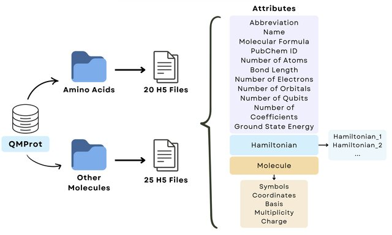

### Abstract
We introduce Quantum Mechanics for Proteins (QMProt), a dataset developed to support quantum computing applications in protein research. QMProt contains precise quantum-mechanical and physicochemical data, enabling accurate characterization of biomolecules and supporting advanced computational methods like molecular fragmentation and reassembly. The dataset includes 45 molecules covering all 20 essential human amino acids and their core structural elements: amino terminal groups, carboxyl terminal groups, alpha carbons, and unique side chains. QMProt primarily features organic molecules with up to 15 non-hydrogen atoms (C, N, O, S), offering comprehensive molecular Hamiltonians, ground state energies, and detailed physicochemical properties. Publicly accessible, QMProt aims to enhance reproducibility and advance quantum-enhanced simulations in molecular biology, biochemistry, and drug discovery.

### Citation

```python
Laia Coronas Sala and Parfait Atchade-Adelmeou. (2025). QMProt: A Comprehensive Dataset of Quantum Properties for Proteins. arXiv. https://doi.org/10.48550/arXiv.2505.08956
```

The dataset can be accessed at https://pennylane.ai/datasets/collection/qmprot and contains the following information for each of the 45 included molecules:


